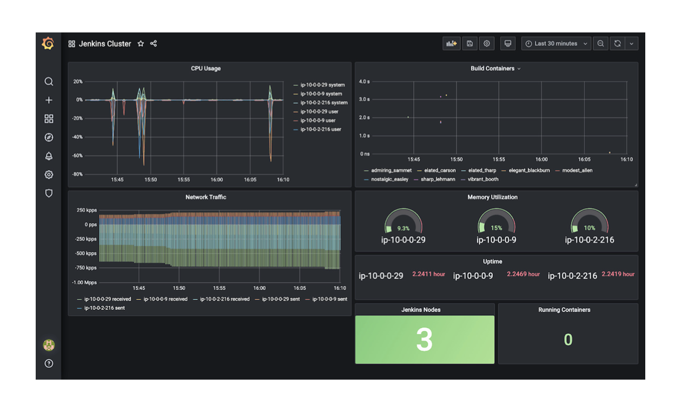

# 1 Real World CI/CD/CM pipeline 
## 1.1 Documentation
```
***********************************
```

## 1.2 Work flow
CICD flow

 
 Microservice architecture

## 1.3 Components
Jenkins job, Jenkins build pipeline, Jenkins deploy pipeline  
AWS Kubernetes Cluster (EKS), AWS Elastic Container Repository, Helm , External DNS  
AWS DynamoDB, Route53, ALB, ASG, S3 bucket  
Github
Docker
Sonarqube  
Anchore
Slack
Packer

## 1.4 Languages
Terraform, YAML, Groovy, Bash  

## 1.5 Related repos
https://github.com/paulappz/quote-microservice-deployments.git  
https://github.com/paulappz/quote-api-gateway.git 
https://github.com/paulappz/quote-service.git  
https://github.com/paulappz/quote-web.git  

# 2 Installation Instructions
## 2.1 Prerequisites
AWS account  
Github account  
Basic knowledge of AWS, Kubernetes, Terraform, Jenkins, Helm chart

## 2.2 Fork and clone your iac-cicd-microservice repo
```
git clone https://github.com/paulappz/iac-cicd-microservice.git
cd iac-cicd-microservice
```

# 3 Bake machine images with Packer 
## 3.1 Download packer - www.packer.io/downloads/. 
 

## 3.2 Bake Image
- Jenkins Self Healing Distributed  (Master & Worker  AMI)
- SonarQube AMI
- Anchore AMI

For example 
 ```
cd sonaqube
packer validate template.json
packer build template.json
```


# 4. Create AWS resource with Terraform
- Bastion server, Jenkins Master, Jenkins Worker, Private & Public RT,VPC, ALB,ECR Cloudwatch, Roles, Subnets, SonarQube, Anchore, 
 ```
cd terraform
terraform init
terraform plan --var-file=variables.tfvars
terraform apply --var-file=variables.tfvars -auto-approve
```
Instances created


Jenkins


# 5. Setup Jenkins Job for the Microservices.
## 5.1 Create Jobs
Jobs created


Job


## 5.2 Config credentials and system plugin integrations for sonarqube, anchore, slack, etc.
Config credentials


Plugin configurations


# 6.  CI/CD
## 3.1 Jenkins build
- Create jenkins pipeline by jenkins job  
Jenkins New Item -> Multibranch Pipeline -> OK  
Source Code Management -> GitHub    
```
https://github.com/paulappz/quote-api-gateway.git 
https://github.com/paulappz/quote-service.git  
https://github.com/paulappz/quote-web.git  t
```
Build Steps -> Process Job  


- Read all branches of microservice repo  
  
- Build stages  
Clone selected microservice repo  
Test
Sonarqube scan  
Docker build  
Login ECR  
Push docker image into ECR  
Anchore Analyzes image


Sonarqube scan
 

Anchore
 

Slack Notifications
## 3.2 Monitoring CICD Process with Slack


# 7. Create EKS cluster
Create Kubernetes cluster and node group, update kubeconfig.  
It will takes about 15 minutes.
```
cd ../eks
terraform init
terraform plan --var-file=variables.tfvars
aws eks update-kubeconfig --name sandbox --region eu-west-2
```

# 8.  Jenkinsfile Pipeline for Deployment stage.
Setup Helm, Config help template for each microservice app  and Write pipeline and push to github

## 8.1 Jenkins deploy
- Create jenkins pipeline by jenkins job  
Jenkins New Item -> Multibranch Pipeline -> OK  
Source Code Management -> GitHub  
```
https://github.com/paulappz/quote-microservice-deployments.git  
```
Build Steps -> Process Job


## 8.2 Helm deploy

```
 helm upgrade --install quote ./quote  \
                --set metadata.jenkins.buildTag=${env.BUILD_TAG} \
                --set metadata.git.commitId=${getCommitId()}
```


Kubernetes Dashboard


## 8.3 verify microservice from web browser AWS LB - 
```
service/quote-api-gateway   LoadBalancer   172.20.201.46    a9cba872f2ce94a718d4b3fb110f1918-701423064.eu-west-2.elb.amazonaws.com   
service/quote-service       LoadBalancer   172.20.149.248   afedb7a71832f44fcbe9f7deb17bf299-1840045078.eu-west-2.elb.amazonaws.com   
service/quote-web           LoadBalancer   172.20.106.3     a8df6fc2c01324cbdbb1e7a1b32d4c55-1946302828.eu-west-2.elb.amazonaws.com 
```
Quote Application


# 9  Monitoring and Logging
## 9.1  Jenkins Monitoring -  Cloudwatch 


## 9.2  Jenkins Monitoring -  Telegraf, InfluxDB, Grafana
Telegraf, InfluxDB, Grafana


Job build Metrics


Cluster health Metrics


## 9.2 Centralized logging for Jenkins logs with ELK


Kibana Dashboard


# 10 Create S3 bucket and DynamoDB table for state management - 
```
cd state-management
terraform init
terraform plan --var-file=variables.tfvars
terraform apply --var-file=variables.tfvars -auto-approve
```

# 11 Cleanup
```
cd iac-cicd-microservice

cd ../eks/
terraform destroy --var-file=variables.tfvars

cd ../terraform/
terraform destroy --var-file=variables.tfvars

cd state-management
terraform destroy --var-file=variables.tfvars
```


